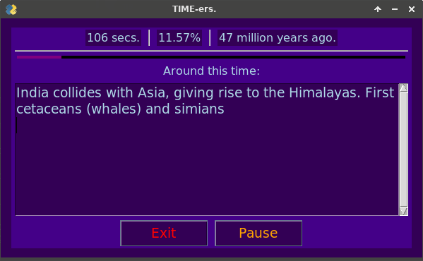
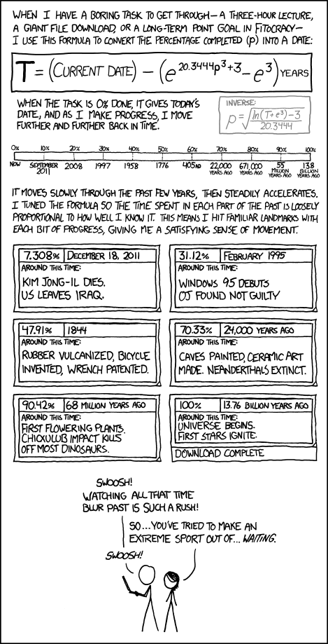

# Extreme Sport

> "So...you've tried to make an extreme sport out of...waiting."

> "Swoosh!"

## Inspiration:

This script is a Python implementation of [XKCD 1017](https://xkcd.com/1017/).

## Installation:

*This program is designed to run on Linux, but should be fairly easy to adapt for Windows devices.*

**Step 1:** Install python 3.10.

**Step 2:** Install pip dependancies with `sudo pip3 install -r requirements.txt`

**Step 3:** Run the program by lauching `Extreme Sport.py`.
